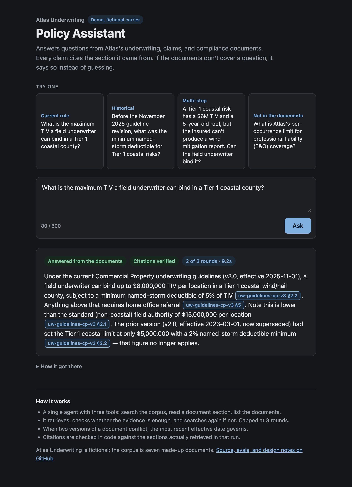
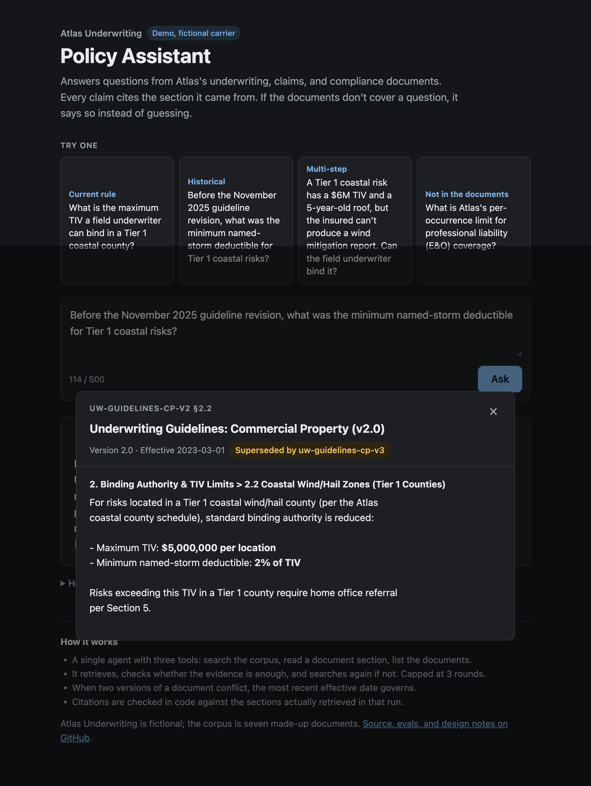
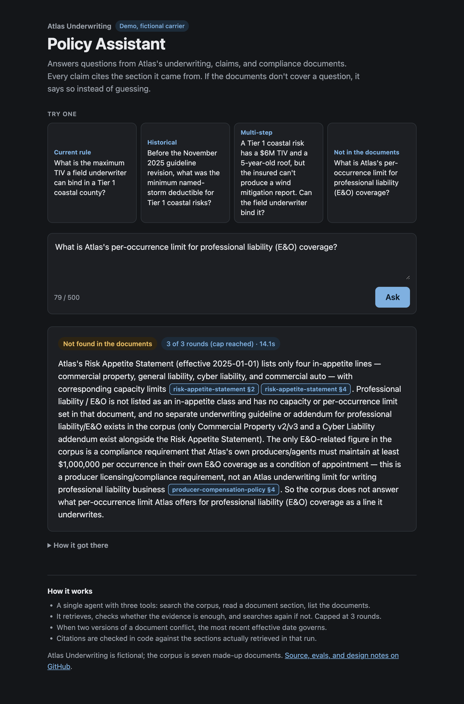
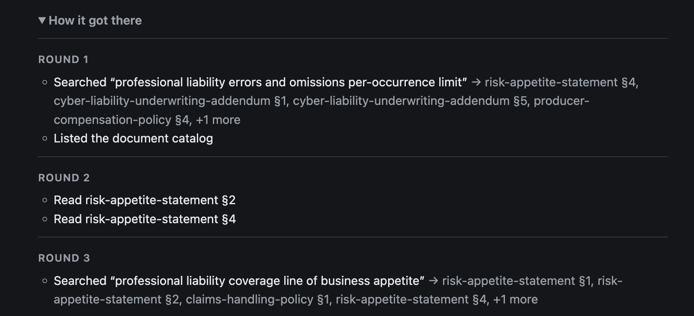

# Atlas RAG Agent

An agentic RAG system I built that answers questions grounded in a
fictional insurance company's (Atlas Underwriting) policy and
compliance documents. Every answer is cited, and the agent explicitly
says "not found" when the corpus doesn't support one.

I built this using an AI-assisted delivery workflow (Claude Code). See
[docs/ai-assisted-delivery.md](docs/ai-assisted-delivery.md) for what I
generated vs. what I architected.

**Try it live: [atlas-rag-agent.onrender.com](https://atlas-rag-agent.onrender.com)**

The page has four sample questions. Each one streams the agent's
rounds as they happen, and every citation opens the source section with
its effective date and whether it's been superseded. It runs on free
tiers, so the first request after 15 idle minutes waits for a cold
start, and there's a limit of 5 questions per visitor per 10 minutes.
The [demo script](docs/demo-script.md) walks through what to look for.

<p align="center">
  
</p>

| Every citation opens its source | Not found, instead of a guess |
|---|---|
|  |  |

<details>
<summary>The round-by-round trace behind the not-found answer</summary>
<p align="center">
  
</p>
</details>

## Results

I measured the agent with a 12-scenario eval (lookups, conflicting
document versions, multi-hop questions, and questions the documents
can't answer), 3 runs each, graded by code checks plus a Claude Opus
claims judge:

| Version | Change | Pass rate | Answer status correct |
|---|---|---|---|
| baseline | first working agent | 86% ±13 | 92% |
| v1 | stricter prompt | 76% ±15 | 92% |
| v2 (shipped) | answer status as a structured field | 90% ±13 | 100% |

The stricter prompt didn't fix the status errors; changing the output
format did. The most common remaining failure is the agent adding a
claim beyond what it retrieved, which the citation check and the judge
both catch. The evaluation section of
[docs/architecture.md](docs/architecture.md) has the details and the
limits of a 12-scenario suite.

## What this demonstrates

- **Agentic retrieval**, not single-pass RAG: an iterative
  retrieve/assess/refine loop across three tools
  (`search_knowledge_base`, `get_document_section`, `list_documents`),
  capped at 3 rounds.
- **Citation-required generation**: if the agent can't cite a source
  for a claim, it doesn't make the claim. It refuses rather than
  answering on thin evidence.
- **A deliberate architecture decision against a planner/orchestrator
  split**: I chose single-agent by design. I documented the reasoning
  for when that pattern would actually be justified in
  [docs/architecture.md](docs/architecture.md).
- **Business/domain decisions I made explicitly**, not left to
  defaults: a document authority and staleness rule for conflicting
  policy versions, a structural (not fixed-token) chunking strategy,
  and the iteration cap above.

## Quickstart

Requires Docker and Node 20+.

```bash
cp .env.example .env   # fill in VOYAGE_API_KEY and ANTHROPIC_API_KEY
npm install
npm run db:up && npm run db:migrate && npm run db:seed
npm run ask -- "What is the maximum TIV a field underwriter can bind in a Tier 1 coastal county?"
```

`npm run ask` prints the answer, the tool calls from each round, and
the citation check. Add `--json` for the full structured result.

For the web page, run `npm run dev` and open http://localhost:3000
(set `PORT` to use another port).

To run the eval suite (12 scenarios x 3 runs, about $1.40 and 25
minutes on Voyage's free tier):

```bash
npm run eval -- --variant v3 --reps 3   # baseline, v1, v2 are recorded; each change gets the next vN
npm run eval:judge-check                # confirms the claims judge on known answers
```

## Deploying

The web service runs on Render's free tier from
[render.yaml](render.yaml), and the database is a free Neon Postgres
project (pgvector is supported). I kept the database off Render because
Render allows one free Postgres per workspace and expires it after 30
days. Free tier tradeoff: the service sleeps after 15 minutes idle, so
the first request after that waits for a cold start.

1. Create a Neon project on Postgres 16 and copy its direct
   (non-pooled) connection string. `prisma migrate` doesn't work through
   the pooler.
2. In the Render dashboard, create a Blueprint from this repo. Enter
   `DATABASE_URL`, `ANTHROPIC_API_KEY` and `VOYAGE_API_KEY` when
   prompted.
3. Each deploy builds the app and runs `prisma migrate deploy`, which
   creates the tables and the pgvector extension the first time.
4. Seed the database once from your machine:

   ```bash
   DATABASE_URL="<neon connection string>" npm run db:seed
   ```

   A `DATABASE_URL` set on the command line takes precedence over the
   one in `.env`.

Pushes to `main` redeploy automatically. The public endpoint is capped
at 5 questions per visitor per 10 minutes and 100 per day in total
(see `src/http/limits.ts`). The daily count is stored in Postgres, so
it holds when the free instance sleeps and restarts. For a hard stop
regardless of the app, also set a monthly spend limit on the Anthropic
account behind `ANTHROPIC_API_KEY`.

## Docs

- [Architecture](docs/architecture.md): the technical and business
  decisions behind the system
- [Demo script](docs/demo-script.md): the two-minute walkthrough I
  use for recordings and live calls
- [AI-assisted delivery log](docs/ai-assisted-delivery.md): what I
  generated vs. what required a decision, session by session

## Status

I've completed five of a planned six sessions: the fictional corpus and
decisions doc, the ingestion pipeline (Voyage embeddings in pgvector),
the agent with its three tools, 3-round cap and citation check, the
eval suite, and the deployed web app with its demo script. The last
session is documentation and wrap-up.
